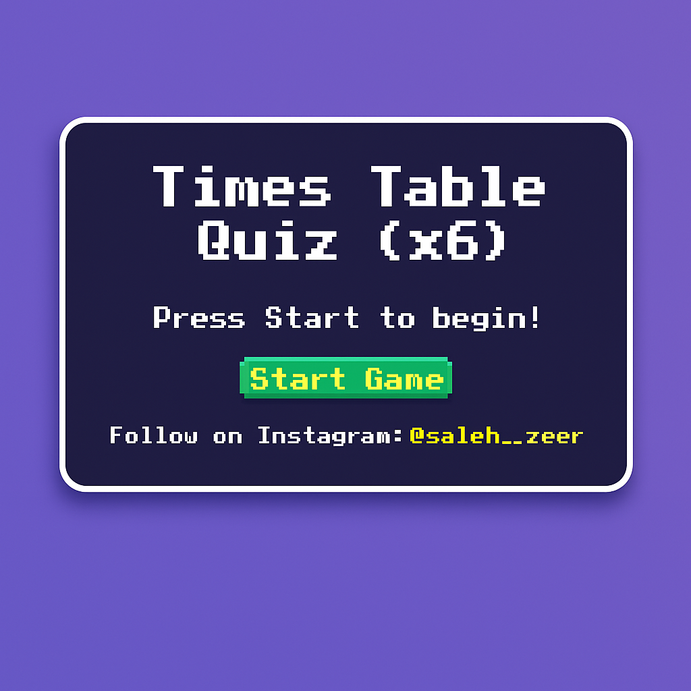

# Multiplication-Table-of-9
# Multiplication-Table-of-14

## Enhancing Learning Through Engaging Tools

As educators, we constantly seek innovative strategies to captivate students' attention and cultivate effective learning environments. While some essential learning tasks require repetitive practice for mastery, they can occasionally become monotonous for both teachers and students.

Introducing elements of fun and engagement can significantly enhance the learning process. Interactive tools like educational games and flashcards are highly effective for helping students memorize abstract concepts, transforming potentially mundane drills into stimulating and memorable challenges.

### Why Use Interactive Tools?

* **Boost Engagement:** Games turn practice into play, increasing student motivation.
* **Improve Retention:** Interactive methods aid memorization of complex or abstract information.
* **Versatile Learning:** Flashcards offer a flexible, portable study aid for self-paced learning.
* **Dynamic Classroom:** These approaches foster a more interactive and enjoyable learning atmosphere.

### Example: Interactive Math Practice

Consider Times Table quizzes as a practical application. They provide an excellent way to practice and master multiplication facts interactively.

💡 **Times Table Quiz Games (x3 - x14):** Make studying engaging and effective. Check them out!

* 🎰 [Multiplication Table of 3](https://lnkd.in/d5WFitgn)
* 🎰 [Multiplication Table of 4](https://lnkd.in/dGmJpWfx)
* 🎰 [Multiplication Table of 5](https://lnkd.in/dbiGqy2Z)
* 🎰 [Multiplication Table of 6](https://lnkd.in/dMY4kBAz)
* 🎰 [Multiplication Table of 7](https://lnkd.in/dg_SNCB4)
* 🎰 [Multiplication Table of 8](https://lnkd.in/dDSuAra2)
* 🎰 [Multiplication Table of 9](https://lnkd.in/djfHsGsT)
* 🎰 [Multiplication Table of 10](https://lnkd.in/dDYWzHRg)
* 🎰 [Multiplication Table of 11](https://lnkd.in/dVfyg8ZF)
* 🎰 [Multiplication Table of 12](https://lnkd.in/dWaCUv8i)
* 🎰 [Multiplication Table of 13](https://lnkd.in/d8vgutPb)
* 🎰 [Multiplication Table of 14](https://lnkd.in/dFqYrfC6)

---

**Keywords:** #MathGames #Education #Quizzes #GamesForEducation #FunLearning #LearnEnglish #EnglishLessons #LanguageLearning
